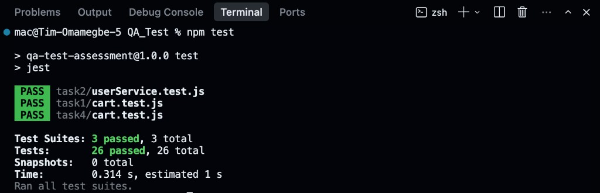

# Automation QA Assessment

This repository contains solutions for the Automation QA Assessment tasks.

## Project Structure

```
├── task1/          # Unit Testing - Cart calculations
│   ├── cart.js
│   └── cart.test.js
├── task2/          # API Testing - User service (with mocked responses)
│   ├── userService.js
│   └── userService.test.js
├── task3/          # Test Design - Login system test cases
│   └── README.md
├── task4/          # Debugging - Corrected failing test
│   ├── cart.js
│   └── cart.test.js
├── assets/         # Screenshots and images
├── package.json
└── README.md
```

## How to Run the Tests

```bash
# Install dependencies
npm install

# Run all tests
npm test

# Run tests for specific tasks
npm run test:task1   # Cart unit tests
npm run test:task2   # User service API tests (mocked)
npm run test:task4   # Corrected cart test
npm run test:all     # All task tests
```

### Example output

Running `npm test` should show all tests passing:



---

## Task 3: Login System Test Cases

When testing a login system for a web application. Here are at least 10 test cases to include in an automated test suite:

1. **Valid credentials** - User can successfully log in with correct username and password
2. **Invalid password** - User cannot log in with correct username but wrong password
3. **Invalid username** - User cannot log in with username that doesn't exist
4. **Empty username field** - System should display validation error when username is blank
5. **Empty password field** - System should display validation error when password is blank
6. **Both fields empty** - System should display appropriate error when both fields are submitted empty
7. **SQL injection attempt and XSS attempt** - System safely handles SQL and script injection injection attempts in input fields for security
8. **Redirect after login** - User is redirected to correct page (e.g., dashboard) after successful login
9. **Password visibility toggle** - Show/hide password toggle works correctly
10. **Case sensitivity** - Username/password validation respects or ignores case based on SRS or PRD (Requirement Documents)

---

## Task 4: Debugging - Why the Test Fails

### Original failing test:

```javascript
test("calculates cart total correctly", () => {
  const items = [
    { price: 10, quantity: 2 },
    { price: 5, quantity: 3 }
  ];
  expect(calculateCartTotal(items, 0.1)).toBe(22.5);
});
```

### Explanation

The test fails because the **expected value is incorrect**. Let's trace through the calculation:

1. **Subtotal**: 
   - Item 1: 10 × 2 = 20
   - Item 2: 5 × 3 = 15
   - **Total before discount: 35**

2. **10% discount (0.1)**:
   - Discount amount: 35 × 0.1 = 3.5
   - **Total after discount: 35 - 3.5 = 31.5**

The test expects `22.5`, but the correct result is `31.5`. There is no mathematical path that would produce 22.5 from these inputs, it appears to be a miscalculation or typo in the expected value.

### Corrected test:

```javascript
test('calculates cart total correctly with 10% discount', () => {
  const items = [
    { price: 10, quantity: 2 },
    { price: 5, quantity: 3 }
  ];
  // Subtotal: 10*2 + 5*3 = 20 + 15 = 35
  // With 10% discount: 35 - (35 * 0.1) = 35 - 3.5 = 31.5
  expect(calculateCartTotal(items, 0.1)).toBe(31.5); 
});
```
